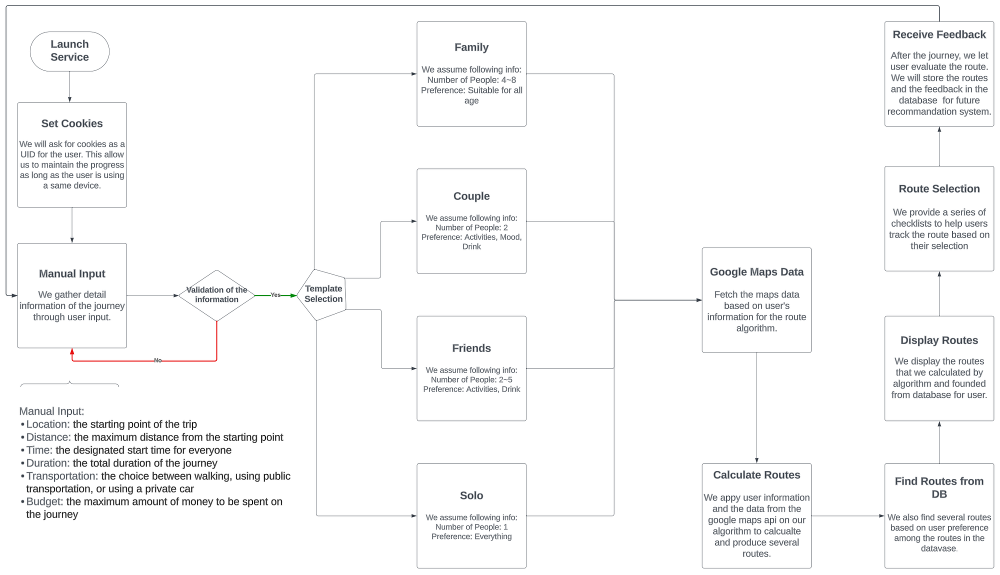

# IndiOne : Code-with-Google-Maps

A mobile-friendly web application that automatically schedules itinerary based on user preferences

## About Team

- Team name: IndiOne
- Members
  - (Leader) Minseok Kim - 200134kms@gmail.com
  - Siwoo Jung - siwoo.jg@gmail.com
  - Seonghyun Kim - seanhyun0301@gmail.com

## Problem Statement

As AI technologies have been developed and made available to the public over the last decade, the demand for a convenient lifestyle has become a growing global issue.

We organized our ideas and devised a plan to address this trend. As a result, we have created an application with the function of recommending multiple routes for customers with various purposes (dating, leisure trips and business, etc.).

Selectable options are integrated into the system to allow users to customize their plans accurately, according to their preferences.

## A Brief of the Prototype



## Tech Stack

### Backend

### Frontend

## Instructions

### Backend

- #### Create and activate Venv

  - Move to **Backend** folder in your terminal
  - Type `python -m venv BackendVenv` (for mac: `python3 -m venv BackendVenv`)
  - Type `./BackendVenv/Scripts/Activate` (for mac: `source BackendVenv/bin/activate`)
  - Select the **python.exe** in the **BackendVenv/Scripts** folder as interpretor of VSC (for mac: **python.exe** is in the **BackendVenv/bin** folder)

- #### Install packages

  - Type `pip install -r requirements.txt`

- #### Input API key

  - Create a json file call **keys.json**
  - Paste your api key in the file
    ```
    {
      "googleApi": "GOOGLE API KEY",
      "databaseUrl": "MONGO DB API KEY"
    }
    ```

- #### Run Server

  - Run **server.py** in the **src** folder
  - If following message appears at the bottom of the terminal, the server is ready
    ```
    * Serving Flask app 'IndiOneApi'
    * Debug mode: off
    WARNING: This is a development server. Do not use it in a production deployment. Use a production WSGI server instead.
    * Running on http://127.0.0.1:5000
    Press CTRL+C to quit
    ```

- #### Deactivate venv
  - Type `deactivate`

### Frontend

- Manage API

  - Locate 'Frontend' folder
    - `cd Frontend`
  - Create **.env** file
  - In **.env** file, insert the following line, with "YOUR_API_KEY" replaced by your API
    ```
    VITE_API_KEY=YOUR_API_KEY
    ```
  - For example,
    ```
    VITE_API_KEY=A1B2C3D4E5F6G7
    ```

- Install packages

  - Type `npm install --legacy-peer-deps`
  - Make sure to include `--legacy-peer-deeps`

- Launch application
  - Type `npm run dev`
  - If your web browser does not automatically launch, locate addresses shown in the terminal
  - For example,
    ```
    Local:   http://localhost:1234/
    ```
- Run application
  - Choose your pereferences
    - Choose **Travel Mode**, one of 'Solo', 'Couple', 'Friends' or 'Family'
    - Choose your starting location
      - Locate **From where?** and click/tap the search bar
      - A new swippable edge is shown. Click/tap 'Starting Location' bar and input your starting location
      - Close the swippable edge
    - Choose your **travelling time**
      - Pick your start and finish times
        - Finish time shall not be earlier than starting time
        - Start time + finish time cannot be more than 24 hours
    - Choose **maxium distance** you would like to travel
      - Locate the slide bar and choose the distance between 1 ~ 50km
    - Choose your **budget**
      - Choose a budget level between 0 and 4 ('$' is level 0)
        - This level corresponds to 'price_level' from Places API
    - Choose your \*_transportation_ mode
    - Press 'FIND MY ITINERARY' button at the botom of the page
  - Wait until the result page is shown
- View results
  - Once the result page is loaded, it shows four different routes based on the themes of **casual**, **Local Specialty**, **Qualitative** and **Shortest**
    - A user can navigate with **BACK** or **NEXT** buttons at the bototm of the page
  - A user can open or close a description card below the map to view detailed information of each itinerary
  - Press **HOME** icon at the bottom to return to the initial page

## Future Scope
